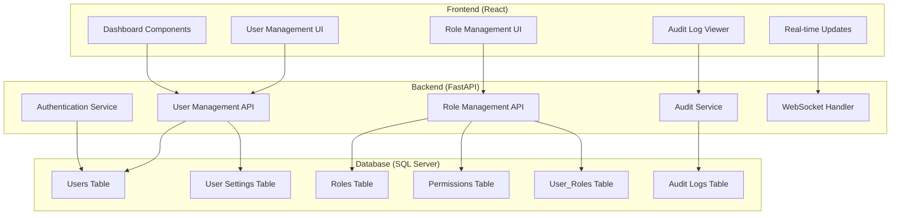

# Design Document

## Overview

This design enhances the existing React + FastAPI + SQL Server dashboard application to provide comprehensive user management functionality. The system will fix existing features and add new capabilities including password management, role-based access control, enhanced audit logging, and real-time dashboard updates.

The architecture maintains the current three-tier structure:
- **Frontend**: React with TypeScript, shadcn/ui components, TanStack Query
- **Backend**: FastAPI with SQLAlchemy ORM
- **Database**: SQL Server with enhanced schema for new features

## Architecture

### Current Architecture Enhancement

The existing architecture will be enhanced with:

1. **Authentication Layer**: Password hashing, session management, role verification
2. **Real-time Communication**: WebSocket connections for live dashboard updates
3. **Enhanced Audit System**: Comprehensive logging with before/after state tracking
4. **Role Management System**: Flexible permission-based access control

### System Components



## Components and Interfaces

### Database Schema Enhancements

#### New Tables

**roles**
```sql
CREATE TABLE roles (
    id INT PRIMARY KEY IDENTITY(1,1),
    name NVARCHAR(50) UNIQUE NOT NULL,
    description NVARCHAR(200),
    permissions TEXT, -- JSON array of permissions
    is_active BIT DEFAULT 1,
    created_at DATETIME2 DEFAULT GETDATE(),
    created_by INT,
    updated_at DATETIME2,
    updated_by INT
);
```

**user_passwords**
```sql
CREATE TABLE user_passwords (
    id INT PRIMARY KEY IDENTITY(1,1),
    user_id INT NOT NULL,
    password_hash NVARCHAR(255) NOT NULL,
    salt NVARCHAR(255) NOT NULL,
    created_at DATETIME2 DEFAULT GETDATE(),
    expires_at DATETIME2,
    is_temporary BIT DEFAULT 0,
    FOREIGN KEY (user_id) REFERENCES users(id) ON DELETE CASCADE
);
```

**user_settings**
```sql
CREATE TABLE user_settings (
    id INT PRIMARY KEY IDENTITY(1,1),
    user_id INT NOT NULL,
    setting_key NVARCHAR(100) NOT NULL,
    setting_value TEXT,
    created_at DATETIME2 DEFAULT GETDATE(),
    updated_at DATETIME2,
    FOREIGN KEY (user_id) REFERENCES users(id) ON DELETE CASCADE,
    UNIQUE(user_id, setting_key)
);
```

#### Enhanced Tables

**users** (add columns)
```sql
ALTER TABLE users ADD 
    role_id INT,
    password_expires_at DATETIME2,
    last_password_change DATETIME2,
    failed_login_attempts INT DEFAULT 0,
    locked_until DATETIME2,
    FOREIGN KEY (role_id) REFERENCES roles(id);
```

**audit2_logs** (enhance existing)
```sql
ALTER TABLE audit2_logs ADD
    before_state TEXT, -- JSON of previous values
    after_state TEXT,  -- JSON of new values
    session_id NVARCHAR(100),
    request_id NVARCHAR(100);
```

### Backend API Enhancements

#### Authentication Service
```python
class AuthService:
    def hash_password(self, password: str) -> tuple[str, str]
    def verify_password(self, password: str, hash: str, salt: str) -> bool
    def generate_temporary_password(self) -> str
    def validate_password_policy(self, password: str) -> bool
    def check_user_permissions(self, user_id: int, permission: str) -> bool
```

#### Role Management API
```python
# New endpoints
POST /api/roles - Create role
GET /api/roles - List roles
PUT /api/roles/{id} - Update role
DELETE /api/roles/{id} - Delete role
POST /api/users/{id}/assign-role - Assign role to user
```

#### Enhanced User Management API
```python
# Enhanced endpoints
POST /api/users/{id}/set-password - Set user password
POST /api/users/{id}/reset-password - Reset password
PUT /api/users/{id}/settings - Update user settings
GET /api/users/{id}/settings - Get user settings
```

#### WebSocket Integration
```python
class WebSocketManager:
    def broadcast_user_update(self, user_data: dict)
    def broadcast_dashboard_update(self, metrics: dict)
    def broadcast_audit_log(self, log_entry: dict)
```

### Frontend Component Enhancements

#### User Management Components
- **UserForm**: Enhanced with password fields and role selection
- **UserList**: Add active/inactive toggle functionality
- **PasswordResetDialog**: New component for password management
- **UserSettingsDialog**: New component for user-specific settings

#### Role Management Components
- **RoleForm**: New component for creating/editing roles
- **RoleList**: New component for displaying roles
- **PermissionSelector**: New component for selecting role permissions

#### Real-time Updates
- **WebSocketProvider**: Context provider for WebSocket connections
- **useRealTimeUpdates**: Custom hook for subscribing to real-time updates
- **ConnectionStatus**: Component showing real-time connection status

## Data Models

### Enhanced Pydantic Models

```python
class RoleBase(BaseModel):
    name: str
    description: Optional[str] = None
    permissions: List[str] = []
    is_active: bool = True

class RoleCreate(RoleBase):
    pass

class RoleUpdate(BaseModel):
    name: Optional[str] = None
    description: Optional[str] = None
    permissions: Optional[List[str]] = None
    is_active: Optional[bool] = None

class RoleResponse(RoleBase):
    id: int
    created_at: datetime
    created_by: Optional[int] = None
    updated_at: Optional[datetime] = None
    updated_by: Optional[int] = None

class PasswordSet(BaseModel):
    password: str
    is_temporary: bool = False
    expires_in_days: Optional[int] = None

class UserSettingUpdate(BaseModel):
    settings: Dict[str, Any]

class EnhancedAuditLog(AuditLogBase):
    before_state: Optional[Dict[str, Any]] = None
    after_state: Optional[Dict[str, Any]] = None
    session_id: Optional[str] = None
    request_id: Optional[str] = None
```

### Frontend TypeScript Interfaces

```typescript
interface Role {
  id: number;
  name: string;
  description?: string;
  permissions: string[];
  is_active: boolean;
  created_at: string;
  created_by?: number;
  updated_at?: string;
  updated_by?: number;
}

interface UserWithRole extends User {
  role_id?: number;
  role?: Role;
  password_expires_at?: string;
  last_password_change?: string;
  failed_login_attempts: number;
  locked_until?: string;
}

interface UserSettings {
  [key: string]: any;
}

interface RealTimeUpdate {
  type: 'user_update' | 'dashboard_update' | 'audit_log';
  data: any;
  timestamp: string;
}
```

## Error Handling

### Backend Error Handling

1. **Authentication Errors**
   - Invalid credentials → 401 Unauthorized
   - Insufficient permissions → 403 Forbidden
   - Account locked → 423 Locked

2. **Validation Errors**
   - Password policy violations → 400 Bad Request with specific requirements
   - Role assignment conflicts → 409 Conflict
   - Duplicate usernames/emails → 409 Conflict

3. **Database Errors**
   - Connection failures → 503 Service Unavailable
   - Constraint violations → 400 Bad Request
   - Transaction failures → 500 Internal Server Error

### Frontend Error Handling

1. **User Feedback**
   - Toast notifications for success/error messages
   - Form validation with specific error messages
   - Loading states during operations

2. **Connection Handling**
   - WebSocket reconnection logic
   - Offline state detection
   - Graceful degradation when real-time features unavailable

## Testing Strategy

### Backend Testing

1. **Unit Tests**
   - Password hashing and validation
   - Role permission checking
   - Audit log creation
   - Database model operations

2. **Integration Tests**
   - API endpoint functionality
   - Database transactions
   - WebSocket message broadcasting
   - Authentication flow

3. **Security Tests**
   - Password policy enforcement
   - Permission boundary testing
   - SQL injection prevention
   - XSS protection

### Frontend Testing

1. **Component Tests**
   - User form validation
   - Role assignment interface
   - Real-time update handling
   - Error state display

2. **Integration Tests**
   - API communication
   - WebSocket connection handling
   - State management
   - Navigation flow

3. **E2E Tests**
   - Complete user management workflow
   - Role assignment process
   - Dashboard real-time updates
   - Audit log viewing

### Performance Considerations

1. **Database Optimization**
   - Proper indexing on frequently queried columns
   - Connection pooling for concurrent requests
   - Audit log archiving strategy

2. **Real-time Updates**
   - WebSocket connection management
   - Message throttling to prevent spam
   - Selective updates based on user permissions

3. **Frontend Optimization**
   - React Query caching for API responses
   - Lazy loading of components
   - Debounced search and filter operations

### Security Measures

1. **Password Security**
   - bcrypt hashing with salt
   - Password policy enforcement
   - Secure password generation

2. **Session Management**
   - JWT tokens with expiration
   - Session invalidation on role changes
   - Concurrent session limits

3. **Audit Trail**
   - Immutable audit logs
   - Comprehensive action tracking
   - IP address and user agent logging

4. **Access Control**
   - Role-based permissions
   - API endpoint protection
   - Frontend route guarding